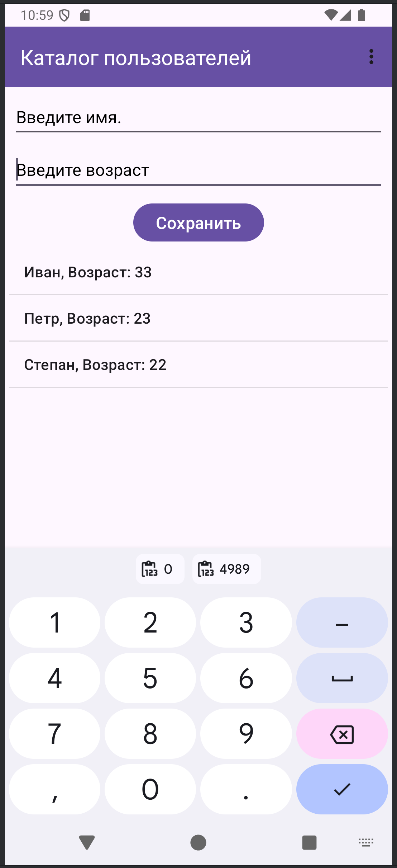
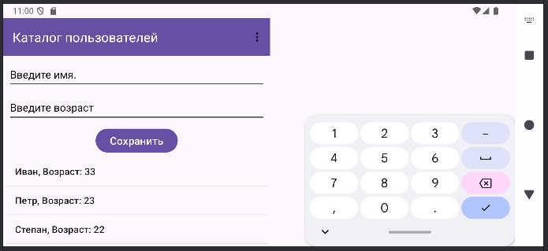

# Домашнее задание SaveInstanceState

## Сохраняем список пользователей при повороте экрана.

На основании приложения «Каталог пользователей», техническое задание по созданию приложения находится в домашнем задании по теме ListView, необходимо дописать логику приложения, чтобы при повороте экрана созданный список был сохранен.

Необходимо создать:

1. Класс UserViewModel, который будет содержать объект MutableLiveData().
   
2. В MainActivity создать и инициализировать экземпляр UserViewModel.
   
3. Подписать адаптер listView на изменения списка с помощью функции observe. Ему передается новый список, снова связывается listView с адаптером, обновляется адаптер с помощью notifyDataSetChanged().
   
4. Не забудьте, что в процессе сохранения введённых данных о пользователе по нажатию на кнопку, после добавления user в список, список передается объекту класса UserViewModel и адаптер снова обновляется.
   
Приложение необходимо сохранить проектом в удаленном репозитории, для проверки качества предоставить ссылку преподавателю, либо сделать скрины эмулятора при каждом шаге работы приложения.

